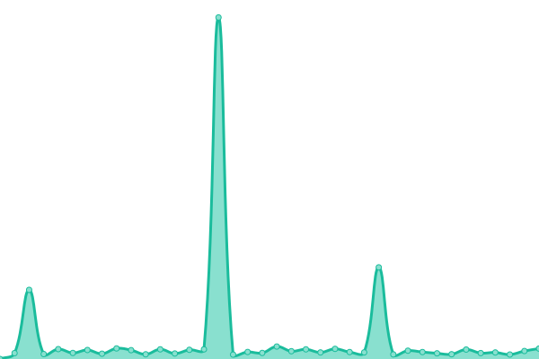
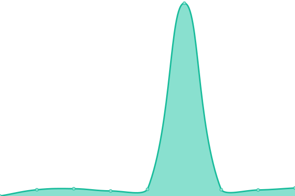

# [📈 Live Status](https://status.mleczki.pl): <!--live status--> **🟧 Partial outage**

This repository contains the open-source uptime monitor and status page for [Michał Mleczko](https://status.mleczki.pl), powered by [Upptime](https://github.com/upptime/upptime).

With [Upptime](https://upptime.js.org), you can get your own unlimited and free uptime monitor and status page, powered entirely by a GitHub repository. We use [Issues](https://github.com/mleczakm/infrastructure-status/issues) as incident reports, [Actions](https://github.com/mleczakm/infrastructure-status/actions) as uptime monitors, and [Pages](https://status.mleczki.pl) for the status page.

<!--start: status pages-->
<!-- This summary is generated by Upptime (https://github.com/upptime/upptime) -->
<!-- Do not edit this manually, your changes will be overwritten -->
<!-- prettier-ignore -->
| URL | Status | History | Response Time | Uptime |
| --- | ------ | ------- | ------------- | ------ |
|  [warsztatowniasensoryczna.pl](https://warsztatowniasensoryczna.pl) | 🟥 Down | [warsztatowniasensoryczna-pl.yml](https://github.com/mleczakm/infrastructure-status/commits/HEAD/history/warsztatowniasensoryczna-pl.yml) | 

 705ms
     
 | 

<a href="https://status.mleczki.pl/history/warsztatowniasensoryczna-pl">99.95%</a>
    

|  [skarbiec.mleczki.pl](https://skarbiec.mleczki.pl) | 🟥 Down | [skarbiec-mleczki-pl.yml](https://github.com/mleczakm/infrastructure-status/commits/HEAD/history/skarbiec-mleczki-pl.yml) | 

 865ms
     
 | 

<a href="https://status.mleczki.pl/history/skarbiec-mleczki-pl">99.95%</a>
    

|  [porin.pl](https://porin.pl) | 🟩 Up | [porin-pl.yml](https://github.com/mleczakm/infrastructure-status/commits/HEAD/history/porin-pl.yml) | 

 3311ms
     
 | 

<a href="https://status.mleczki.pl/history/porin-pl">51.15%</a>
    

|  [Monitoring na Frogu](https://frog03-21363.wykr.es) | 🟩 Up | [monitoring-na-frogu.yml](https://github.com/mleczakm/infrastructure-status/commits/HEAD/history/monitoring-na-frogu.yml) | 

 2783ms
     
 | 

<a href="https://status.mleczki.pl/history/monitoring-na-frogu">99.32%</a>
    

|  [Test wersji v2 skarbca (standalone)](https://skarbiec.mleczki.pl) | 🟩 Up | [test-wersji-v2-skarbca-standalone.yml](https://github.com/mleczakm/infrastructure-status/commits/HEAD/history/test-wersji-v2-skarbca-standalone.yml) | 

 787ms
     
 | 

<a href="https://status.mleczki.pl/history/test-wersji-v2-skarbca-standalone">99.95%</a>
    

<!--end: status pages-->

[**Visit our status website →**](https://status.mleczki.pl)

## 📄 License

- Powered by: [Upptime](https://github.com/upptime/upptime)
- Code: [MIT](./LICENSE) © [Anand Chowdhary](https://anandchowdhary.com), supported by [Pabio](https://pabio.com)
- Data in the `./history` directory: [Open Database License](https://opendatacommons.org/licenses/odbl/1-0/)

## 🛠 Cloudflare DNS Verification

This repository includes a GitHub Workflow to automatically verify and update the Cloudflare DNS record for your custom domain (configured in `.upptimerc.yml`).

To use this feature, you must add the following [GitHub Secrets](https://github.com/mleczakm/infrastructure-status/settings/secrets/actions) to your repository:

- `CLOUDFLARE_API_TOKEN`: A Cloudflare API token with `Zone:DNS:Edit` permissions.
- `CLOUDFLARE_ZONE_ID`: The Zone ID for your domain in Cloudflare.
