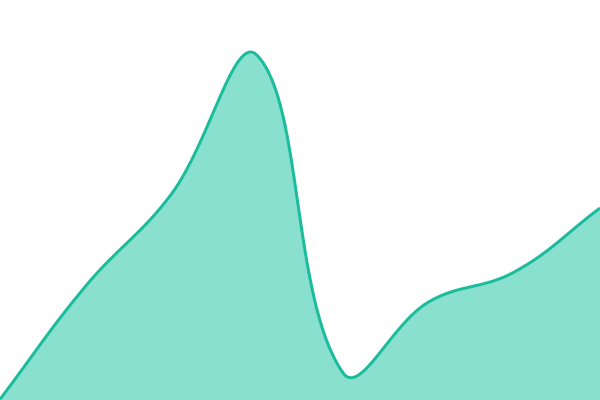
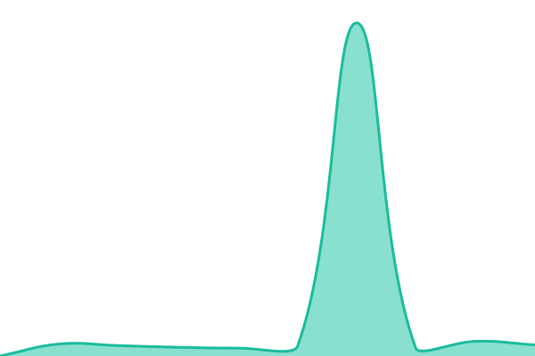

# [📈 Live Status](https://status.mleczki.pl): <!--live status--> **🟩 All systems operational**

This repository contains the open-source uptime monitor and status page for [Michał Mleczko](https://status.mleczki.pl), powered by [Upptime](https://github.com/upptime/upptime).

With [Upptime](https://upptime.js.org), you can get your own unlimited and free uptime monitor and status page, powered entirely by a GitHub repository. We use [Issues](https://github.com/mleczakm/infrastructure-status/issues) as incident reports, [Actions](https://github.com/mleczakm/infrastructure-status/actions) as uptime monitors, and [Pages](https://status.mleczki.pl) for the status page.

<!--start: status pages-->
<!-- This summary is generated by Upptime (https://github.com/upptime/upptime) -->
<!-- Do not edit this manually, your changes will be overwritten -->
<!-- prettier-ignore -->
| URL | Status | History | Response Time | Uptime |
| --- | ------ | ------- | ------------- | ------ |
|  [mleczki.pl](https://mleczki.pl) | 🟩 Up | [mleczki-pl.yml](https://github.com/mleczakm/infrastructure-status/commits/HEAD/history/mleczki-pl.yml) | 

 226ms
     
 | 

<a href="https://status.mleczki.pl/history/mleczki-pl">100.00%</a>
    

|  [Cargo Mleczki](https://cargo.mleczki.pl) | 🟩 Up | [cargo-mleczki.yml](https://github.com/mleczakm/infrastructure-status/commits/HEAD/history/cargo-mleczki.yml) | 

 774ms
     
 | 

<a href="https://status.mleczki.pl/history/cargo-mleczki">100.00%</a>
    

|  [ceramiza.pl](https://ceramiza.pl) | 🟩 Up | [ceramiza-pl.yml](https://github.com/mleczakm/infrastructure-status/commits/HEAD/history/ceramiza-pl.yml) | 

 797ms
     
 | 

<a href="https://status.mleczki.pl/history/ceramiza-pl">100.00%</a>
    

|  [Warsztatownia Sensoryczna](https://warsztatowniasensoryczna.pl) | 🟩 Up | [warsztatownia-sensoryczna.yml](https://github.com/mleczakm/infrastructure-status/commits/HEAD/history/warsztatownia-sensoryczna.yml) | 

 1663ms
     
 | 

<a href="https://status.mleczki.pl/history/warsztatownia-sensoryczna">100.00%</a>
    

|  [ClassyCash - aplikacja wspierająca pracę skarbników klasowych](https://skarbiec.mleczki.pl) | 🟩 Up | [classy-cash-aplikacja-wspierajaca-prace-skarbnikow-klasowych.yml](https://github.com/mleczakm/infrastructure-status/commits/HEAD/history/classy-cash-aplikacja-wspierajaca-prace-skarbnikow-klasowych.yml) | 

 1406ms
     
 | 

<a href="https://status.mleczki.pl/history/classy-cash-aplikacja-wspierajaca-prace-skarbnikow-klasowych">100.00%</a>
    

|  [Classy Cash - strona projektu](https://classycash.dpdns.org) | 🟩 Up | [classy-cash-strona-projektu.yml](https://github.com/mleczakm/infrastructure-status/commits/HEAD/history/classy-cash-strona-projektu.yml) | 

 208ms
     
 | 

<a href="https://status.mleczki.pl/history/classy-cash-strona-projektu">100.00%</a>
    

|  [PORIN - kompleksowa budowa domów](https://porin.pl) | 🟩 Up | [porin-kompleksowa-budowa-domow.yml](https://github.com/mleczakm/infrastructure-status/commits/HEAD/history/porin-kompleksowa-budowa-domow.yml) | 

 1277ms
     
 | 

<a href="https://status.mleczki.pl/history/porin-kompleksowa-budowa-domow">100.00%</a>
    

|  [Monitoring na Frogu](http://frog03.mikr.us:21363) | 🟩 Up | [monitoring-na-frogu.yml](https://github.com/mleczakm/infrastructure-status/commits/HEAD/history/monitoring-na-frogu.yml) | 

 345ms
     
 | 

<a href="https://status.mleczki.pl/history/monitoring-na-frogu">100.00%</a>
    

|  [śledź.mleczki.pl](https://xn--led-bza2n.mleczki.pl) | 🟩 Up | [sledz-mleczki-pl.yml](https://github.com/mleczakm/infrastructure-status/commits/HEAD/history/sledz-mleczki-pl.yml) | 

 1540ms
     
 | 

<a href="https://status.mleczki.pl/history/sledz-mleczki-pl">100.00%</a>
    

|  [SprintSpaces - strona](https://sprintspaces.github.io/) | 🟩 Up | [sprint-spaces-strona.yml](https://github.com/mleczakm/infrastructure-status/commits/HEAD/history/sprint-spaces-strona.yml) | 

 109ms
     
 | 

<a href="https://status.mleczki.pl/history/sprint-spaces-strona">100.00%</a>
    

|  [SprintSpaces - demo](https://wanda192-20090.mikrus.cloud/v1/stats) | 🟩 Up | [sprint-spaces-demo.yml](https://github.com/mleczakm/infrastructure-status/commits/HEAD/history/sprint-spaces-demo.yml) | 

 786ms
     
 | 

<a href="https://status.mleczki.pl/history/sprint-spaces-demo">100.00%</a>
    

|  [BezReszty - aplikacja](https://bezreszty.org.pl/healthz) | 🟩 Up | [bez-reszty-aplikacja.yml](https://github.com/mleczakm/infrastructure-status/commits/HEAD/history/bez-reszty-aplikacja.yml) | 

 808ms
     
 | 

<a href="https://status.mleczki.pl/history/bez-reszty-aplikacja">100.00%</a>
    

|  [PomagaSie - strona](https://pomagasie.github.io/) | 🟩 Up | [pomaga-sie-strona.yml](https://github.com/mleczakm/infrastructure-status/commits/HEAD/history/pomaga-sie-strona.yml) | 

 99ms
     
 | 

<a href="https://status.mleczki.pl/history/pomaga-sie-strona">100.00%</a>
    

<!--end: status pages-->

[**Visit our status website →**](https://status.mleczki.pl)

## 📄 License

- Powered by: [Upptime](https://github.com/upptime/upptime)
- Code: [MIT](./LICENSE) © [Anand Chowdhary](https://anandchowdhary.com), supported by [Pabio](https://pabio.com)
- Data in the `./history` directory: [Open Database License](https://opendatacommons.org/licenses/odbl/1-0/)

## 🛠 Cloudflare DNS Verification

This repository includes a GitHub Workflow to automatically verify and update the Cloudflare DNS record for your custom domain (configured in `.upptimerc.yml`).

To use this feature, you must add the following [GitHub Secrets](https://github.com/mleczakm/infrastructure-status/settings/secrets/actions) to your repository:

- `CLOUDFLARE_API_TOKEN`: A Cloudflare API token with `Zone:DNS:Edit` permissions.
- `CLOUDFLARE_ZONE_ID`: The Zone ID for your domain in Cloudflare.
